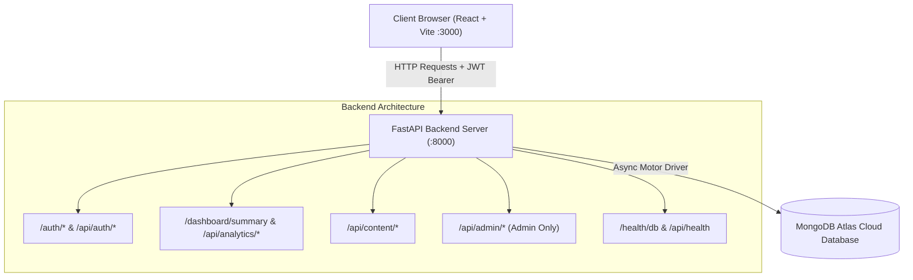
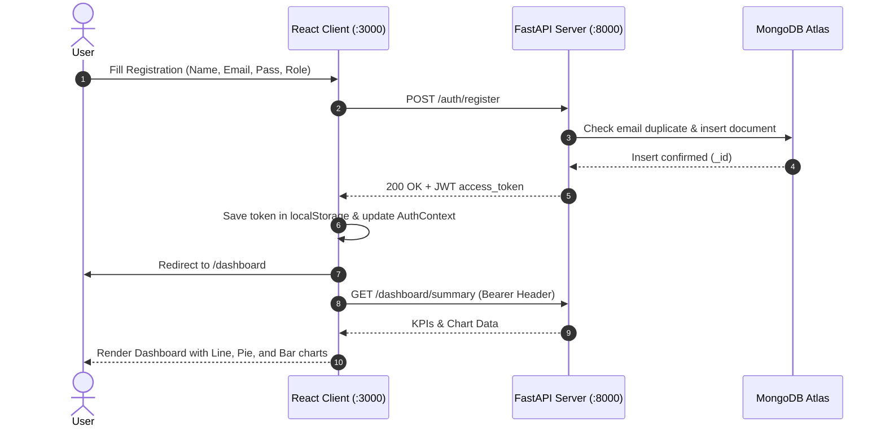

# 📐 CreatorIQ — System Design, UI Wireframes & Architecture (Milestone 1)

> **Project:** CreatorIQ Platform  
> **Project Name:** CreatorIQ — Creator Analytics & Influencer Management Platform  
> **Milestone:** Milestone 1 (Week 1 & 2) — Project Initialization, Design & Core Setup  
> **Tech Stack:** React (Vite) + TailwindCSS + Recharts + FastAPI (Python 3.12) + MongoDB Atlas  

---

## 📑 Table of Contents
1. [Executive Summary](#executive-summary)
2. [High-Level System Architecture](#high-level-system-architecture)
3. [Database Schema & Collections (MongoDB Atlas)](#database-schema--collections-mongodb-atlas)
4. [API Endpoints Reference](#api-endpoints-reference)
5. [User Journey & State Flow Diagram](#user-journey--state-flow-diagram)
6. [ASCII UI Wireframes](#ascii-ui-wireframes)
   - [Screen 1: Login Page with Quick Demo Login](#screen-1-login-page-with-quick-demo-login)
   - [Screen 2: Account Registration with Role Selection](#screen-2-account-registration-with-role-selection)
   - [Screen 3: Main Creator Dashboard](#screen-3-main-creator-dashboard)
   - [Screen 4: Content Management Hub](#screen-4-content-management-hub)
   - [Screen 5: Deep-Dive Audience Analytics](#screen-5-deep-dive-audience-analytics)
   - [Screen 6: Administrator Control Panel (RBAC)](#screen-6-administrator-control-panel-rbac)
7. [Milestone 1 Verification & Evaluation Rubric](#milestone-1-verification--evaluation-rubric)

---

## 1. Executive Summary

CreatorIQ is a specialized analytics and influencer management workspace engineered to consolidate multi-channel creator metrics (YouTube, Instagram, LinkedIn, X). For **Milestone 1**, our core objectives are:
- Robust project scaffolding with modular backend and frontend separation.
- Secure, token-based authentication using **JWT Bearer tokens** and **bcrypt** password hashing.
- Simple Role-Based Access Control (**RBAC**) supporting `creator` and `admin` roles.
- Live cloud database persistence utilizing **MongoDB Atlas**.
- Responsive, dark-themed dashboard presenting 4 key metrics cards and 3 reactive **Recharts** charts.

---

## 2. High-Level System Architecture



---

## 3. Database Schema & Collections (MongoDB Atlas)

### `users` Collection
Stores registered user credentials, profile information, and role assignments:
```json
{
  "_id": "ObjectId('6aac209d22033336b5f19709')",
  "name": "Alex Smith",
  "full_name": "Alex Smith",
  "email": "alex.creator@creatoriq.com",
  "password_hash": "$2b$12$e8Y4J2a7R...[bcrypt]",
  "role": "creator", // Options: "creator" | "admin"
  "profile_picture": null,
  "created_at": "2026-09-17T22:45:00.000Z",
  "platform_accounts": []
}
```

### `content` Collection
Catalogs individual posts, videos, and reels tracked by the creator:
```json
{
  "_id": "ObjectId('7bbc310e33144447c6f2081a')",
  "user_id": "6aac209d22033336b5f19709",
  "title": "Top 10 Tech Gadgets 2026",
  "platform": "youtube",
  "url": "https://youtube.com/watch?v=sample123",
  "views": 25400,
  "likes": 3200,
  "comments": 450,
  "shares": 180,
  "engagement_rate": 15.07,
  "created_at": "2026-09-17T22:46:00.000Z"
}
```

### `analytics` Collection (Milestone 2 Foundation)
Stores time-series periodic metric snapshots for trend forecasting:
```json
{
  "_id": "ObjectId('8ccd421f44255558d7a3192b')",
  "user_id": "6aac209d22033336b5f19709",
  "platform": "youtube",
  "views": 45230,
  "likes": 8234,
  "followers": 12450,
  "engagement_rate": 5.6,
  "captured_at": "2026-09-17T00:00:00.000Z"
}
```

---

## 4. API Endpoints Reference

| Method | Route | Description | Access |
|---|---|---|---|
| `GET` | `/` | API Health & status root | Public |
| `GET` | `/health/db` | Live MongoDB Atlas ping | Public |
| `POST` | `/auth/register` | User account creation with role | Public |
| `POST` | `/auth/login` | JWT token authentication | Public |
| `GET` | `/auth/me` | Current authenticated user profile | Bearer Token |
| `GET` | `/dashboard/summary` | 4 KPI totals, 7-day line chart data, platform donut share | Bearer Token |
| `POST` | `/api/content` | Publish / catalog new content item | Bearer Token |
| `GET` | `/api/content` | List cataloged content items | Bearer Token |
| `GET` | `/api/admin/users` | List all users in MongoDB (RBAC protected) | Admin Only |

---

## 5. User Journey & State Flow Diagram



---

## 6. ASCII UI Wireframes

### Screen 1: Login Page with Quick Demo Login
```
+-----------------------------------------------------------------+
|                                                                 |
|                      [ C ] CreatorIQ                            |
|                     CreatorIQ Login                             |
|          Sign in to your Creator Analytics Dashboard            |
|                                                                 |
|   EMAIL ADDRESS                                                 |
|   +---------------------------------------------------------+   |
|   | creator@creatoriq.com                                   |   |
|   +---------------------------------------------------------+   |
|                                                                 |
|   PASSWORD                                                      |
|   +---------------------------------------------------------+   |
|   | ••••••••••••••••                                        |   |
|   +---------------------------------------------------------+   |
|                                                                 |
|   +---------------------------------------------------------+   |
|   |                 [->] Sign In to Dashboard               |   |
|   +---------------------------------------------------------+   |
|                                                                 |
|   ----------------- 1-Click Quick Demo Login ----------------   |
|   +-------------------------------+ +-----------------------+   |
|   |          Demo Creator         | |       Demo Admin      |   |
|   +-------------------------------+ +-----------------------+   |
|                                                                 |
|               Don't have an account? Register                   |
+-----------------------------------------------------------------+
```

### Screen 2: Account Registration with Role Selection
```
+-----------------------------------------------------------------+
|                                                                 |
|                      [ C ] CreatorIQ                            |
|                   Create Account                                |
|          Get started with creator performance tracking          |
|                                                                 |
|   FULL NAME                                                     |
|   +---------------------------------------------------------+   |
|   | Alex Creator                                            |   |
|   +---------------------------------------------------------+   |
|   EMAIL ADDRESS                                                 |
|   +---------------------------------------------------------+   |
|   | alex@creatoriq.com                                      |   |
|   +---------------------------------------------------------+   |
|   PASSWORD (min 6)                                              |
|   +---------------------------------------------------------+   |
|   | ••••••••••••••••                                        |   |
|   +---------------------------------------------------------+   |
|   ACCOUNT ROLE (RBAC)                                           |
|   +---------------------------------------------------------+   |
|   | Creator (Personal Analytics & Content)                V |   |
|   | Administrator (Full System Control)                     |   |
|   +---------------------------------------------------------+   |
|                                                                 |
|   +---------------------------------------------------------+   |
|   |                 [+] Register Account                    |   |
|   +---------------------------------------------------------+   |
|                                                                 |
|               Already have an account? Login                    |
+-----------------------------------------------------------------+
```

### Screen 3: Main Creator Dashboard
```
+---------------+-------------------------------------------------------------------------+
| [C] CreatorIQ | Dashboard Overview      [ MongoDB: Connected (o) ] [ MS-1: Week 1 & 2 ] |
+---------------+-------------------------------------------------------------------------+
| (A) Alex      | Welcome, Alex 👋                                                        |
|  CREATOR      | Multi-platform audience and performance breakdown for this week.        |
|               |                                                                         |
| > Dashboard   | +-----------------+ +-----------------+ +---------------+ +------------+|
| - Content     | | TOTAL VIEWS     | | TOTAL LIKES     | | FOLLOWERS     | | ENGAGEMENT ||
| - Analytics   | | 45,230  (+14%)  | | 8,234   (+8.7%) | | 12,450 (+5%)  | | 5.6% (+1.8)|
|               | +-----------------+ +-----------------+ +---------------+ +------------+|
|               |                                                                         |
|               | +---------------------------------------------------------------------+ |
|               | | Weekly Performance Trends (Last 7 Days)                             | |
|               | |  Views (Indigo Line) vs Follower Retention (Pink Line)              | |
|               | |    ^                                                                | |
|               | | 7k |              /---\                                             | |
|               | | 5k |        /----\     \-----\                                      | |
|               | | 3k |  /----\                  \                                     | |
|               | |    +---+-----+-----+-----+-----+-----+-----+                        | |
|               | |       Mon   Tue   Wed   Thu   Fri   Sat   Sun                       | |
|               | +---------------------------------------------------------------------+ |
|               |                                                                         |
|               | +------------------------------+ +------------------------------------+ |
|               | | Platform Distribution (Donut)| | Audience Growth (Bar Chart)        | |
|               | |   (O) YouTube: 45%           | |   [|] [|] [|] [|] [|] [|] [|]      | |
|               | |       Instagram: 30%         | |    M   T   W   T   F   S   S       | |
|               | |       LinkedIn: 15% | X: 10% | |   Daily Impressions                | |
| [<-] Logout   | +------------------------------+ +------------------------------------+ |
+---------------+-------------------------------------------------------------------------+
```

### Screen 4: Content Management Hub
```
+---------------+-------------------------------------------------------------------------+
| [C] CreatorIQ | Content Library                                                         |
+---------------+-------------------------------------------------------------------------+
| > Dashboard   | Publish New Content Post                                                |
| > Content     | +---------------------+ +---------------+ +---------------------------+ |
| - Analytics   | | Post Title          | | Platform    V | | [+] Add to Library        | |
|               | +---------------------+ +---------------+ +---------------------------+ |
|               |                                                                         |
|               | Cataloged Posts (12)                                                    |
|               | +--------------------------+----------+---------+---------+-----------+ |
|               | | Title                    | Platform | Views   | Likes   | Eng. Rate | |
|               | +--------------------------+----------+---------+---------+-----------+ |
|               | | Top 10 React Tips 2026   | YOUTUBE  | 25,400  | 3,200   | 15.07%    | |
|               | | Behind the Scenes Reel   | INSTA    | 18,900  | 2,100   | 12.4%     | |
|               | | Python FastAPI Tutorial  | YOUTUBE  | 34,100  | 4,500   | 18.2%     | |
| [<-] Logout   | +--------------------------+----------+---------+---------+-----------+ |
+---------------+-------------------------------------------------------------------------+
```

### Screen 5: Deep-Dive Audience Analytics
```
+---------------+-------------------------------------------------------------------------+
| [C] CreatorIQ | Growth & Audience Analytics                                             |
+---------------+-------------------------------------------------------------------------+
| - Dashboard   | [ Retention: 72.4% ] [ CTR: 8.9% ] [ Growth: +18.2% ] [ Reach: 1.42x ]  |
| - Content     |                                                                         |
| > Analytics   | +------------------------------+ +------------------------------------+ |
|               | | Audience Age Distribution    | | Top Geographic Reach               | |
|               | | 18-24: [========    ] 42%    | | 🇺🇸 United States            38%    | |
|               | | 25-34: [=======     ] 36%    | | 🇮🇳 India                    26%    | |
|               | | 35-44: [===         ] 14%    | | 🇬🇧 United Kingdom           14%    | |
|               | | 45+:   [=           ] 8%     | | 🇨🇦 Canada                   12%    | |
| [<-] Logout   | +------------------------------+ +------------------------------------+ |
+---------------+-------------------------------------------------------------------------+
```

### Screen 6: Administrator Control Panel (RBAC)
```
+---------------+-------------------------------------------------------------------------+
| [C] CreatorIQ | Administrator Panel (Protected - Admin Only)            [ Total: 4 ]    |
+---------------+-------------------------------------------------------------------------+
| - Dashboard   | Registered Platform Users (Queried from MongoDB Atlas)                  |
| - Content     | +------------------+-----------------------+----------+---------------+ |
| - Analytics   | | Name             | Email                 | Role     | Registered At | |
| > Admin Panel | +------------------+-----------------------+----------+---------------+ |
|               | | Alex Creator     | alex@creatoriq.com    | CREATOR  | 2026-09-17    | |
|               | | Lead Admin       | admin@creatoriq.com   | ADMIN    | 2026-09-17    | |
| [<-] Logout   | +------------------+-----------------------+----------+---------------+ |
+---------------+-------------------------------------------------------------------------+
```

---

## 7. Milestone 1 Verification & Evaluation Rubric

| Requirement | Evaluation Criteria | Milestone Status |
|---|---|---|
| **FastAPI Backend** | Runs on port 8000, provides Swagger UI at `/docs` | ✅ Verified |
| **MongoDB Atlas** | Live cloud cluster connection, persists users & content | ✅ Verified |
| **JWT Authentication** | Secure token generation, password hashing via bcrypt | ✅ Verified |
| **Role-Based Access** | Simple Creator and Admin role enforcement | ✅ Verified |
| **React Frontend** | Vite development server running on port 3000 | ✅ Verified |
| **KPIs & Recharts** | 4 Dynamic metric cards and 3 charts (Line, Pie, Bar) | ✅ Verified |
| **Automated Tests** | `python verify_backend.py` passes all 8 test suites | ✅ Verified |
